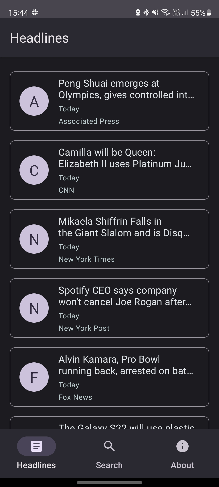
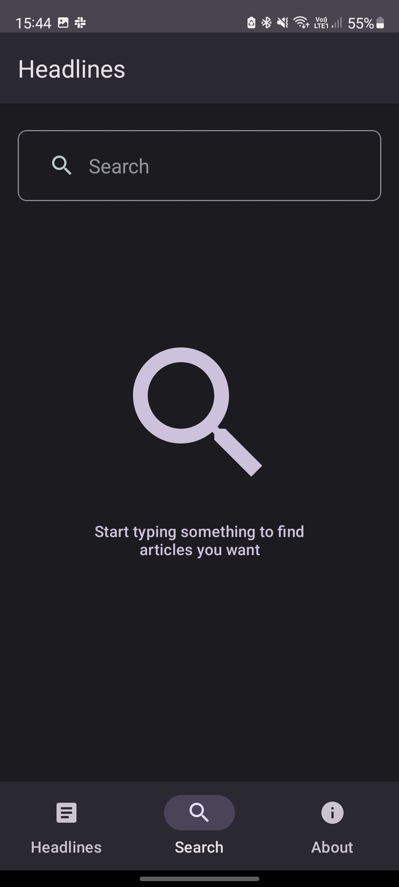
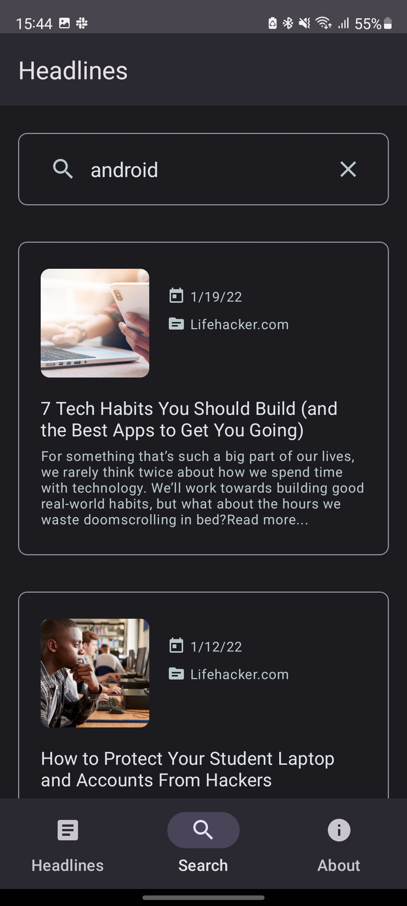
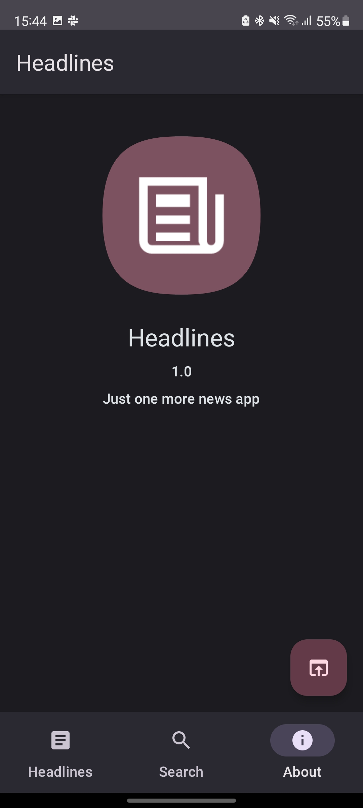
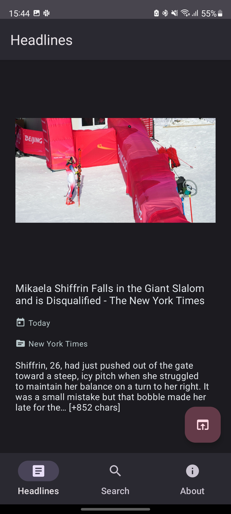

# View Based Android Sample

This sample is a simple news app that gives user abilities to see top headlines and to search for some articles.

## Screenshots

## Why we created this sample
This project has been created due to show our approach to everyone within the team.
It's a quite simple android app, but it demonstrates core features of the way we develop big and scalable production apps.
## How to use this sample
This sample includes some basic cases that are needed almost for any android app.
So, if you need to setup a new project, it can help you as an example how everything should work overall.
It's not a bootstrap project, don't use it as a template to start from.
## Topics
* DI
* Navigation
* Architecture
* Paging
* Theming
* Network
* View Based UI

## How to run
* You need Android Studio (at least Arctic Fox) with Kotlin plugin (at least 1.6.10)
* Run -> Run 'app'
## Known issues
* The used API has quite hard limits for developers
## Who to contact with questions
* [Daniil Bugay](https://gitlab.com/daniil.bugai)